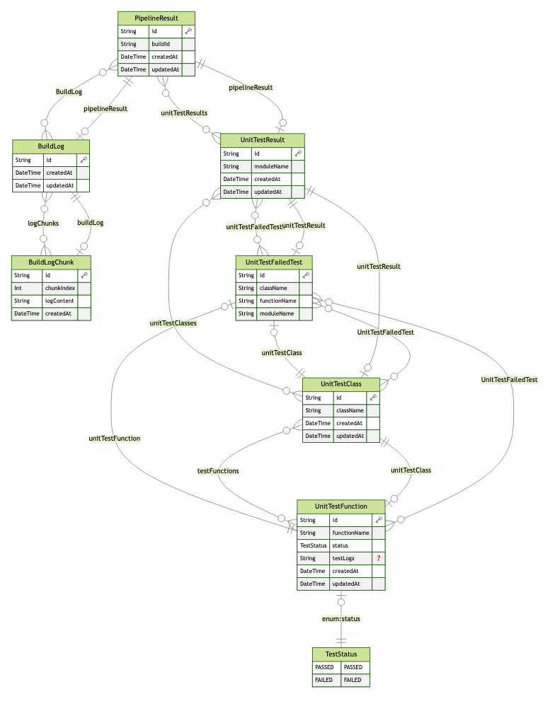

# nx-prisma-nestjs-example

테스트의 결과를 DB로 저장하고, 이를 프론트에 제공하기 위한 예제들 모음

기본 스택:

- NX workspace
- Nest.js for Backend application
- Prisma for ORM
- Postgres for DB

가장 기본이 되는 데이터의 형태는 다음과 같음:

- 파이프라인 결과
  - 유닛 테스트 모듈 (1:n) / 1번 실행마다 45+
    - 유닛 테스트 클래스 (1:n) / 1번 실행마다 200+
      - 유닛 테스트 함수 (1:n) / 1번 실행마다 3000+
        - 테스트 상태

## 1. Prisma 기능 확장

- https://github.com/WindSekirun/nx-prisma-nestjs-example/commit/26ff258f2d4fc65e02651e09e8b2402fed618f0a
- refer: https://github.com/prisma/prisma/issues/18628#issuecomment-1975271421

Prisma에서 기본으로 제공하지 않는 기능이나, 후술할 cuid2를 위해 Prisma의 기능을 확장시킬 수 있음.
또한, Global Module로 등록함으로서 개별 모듈에서 참조를 하지 않아도 됨

## 2. cuid2

- https://github.com/WindSekirun/nx-prisma-nestjs-example/commit/409b360661f8faaad1c623a2975930b55fb8e000#diff-0ea972252d10343108d3a06435b504515bda939ee9d3aea2a247b363ba7f6d8eR8

autoincrement int 대신 cuid를 사용할 수 있는데, 아래와 같은 포인트들이 있음

- 수평 확장성
- autoincrement 는 길이가 일정하지 않음
- UUID도 대안 중 한 개이지만 길고, '-'로 나눠져있어서 복사하기 불편함

다만 cuid는 보안성 문제로 인해 cuid2를 사용하는 것이 권장되는데, 아직까지 prisma 는 cuid2를 공식 지원하지 않음

- https://github.com/paralleldrive/cuid2
- https://github.com/prisma/prisma/issues/17102

따라서 https://www.npmjs.com/package/prisma-extension-cuid2 를 사용할 수 있고,
Prisma 기능 확장을 했다면 다음과 같이 사용 가능

```ts
import cuid2Extension from 'prisma-extension-cuid2';

base.$extends(
    cuid2Extension({
      // 정의하지 않은 경우 *:id 패턴을 사용하여 예상치 않은 버그를 일으킬 수 있으므로
      // 가능하면 cuid2를 사용할 모든 id를 정의하는 것이 좋음
      fields: [
        'PipelineResult:id',
        'UnitTestResult:id',
        'TestClass:id',
        'TestFunction:id',
        'BuildLog:id',
      ],
    })
  );
```

## 3. ERD
https://github.com/keonik/prisma-erd-generator 를 사용하여 Prisma Schema를 기반으로 자동 생성할 수 있음

```
generator erd {
  provider = "prisma-erd-generator"
  output   = "../../../docs/ERD.svg"
}
```



svg, md, png 등 다양한 포맷이 제공되고, 여러 개의 확장자로 출력하고 싶다면 복붙 후 generator의 이름만 변경하면 OK

## 4. 데이터 구조에 따른 초기 Index

- https://github.com/WindSekirun/nx-prisma-nestjs-example/commit/409b360661f8faaad1c623a2975930b55fb8e000#diff-8868ba6f6bd7aa7823c3f1321cd671c494f85afdffb5df12ed2906d049a40adaR60

상술한 기본 데이터 구조에서, 파이프라인을 수행하는 Agent의 고유 ID가 Key로 되고,
(여기에서는 BUILD_ID라고 가정)
단순한 데이터의 리스트는 조회에 문제는 없지만, 대략적인 정보를 보여주어야 하는 경우에는 조회 성능에 영향을 미칠 수 있음.

그래서 적절한 Index를 미리 고려하는 것이 중요함.

단 인덱스를 생성하게 되면 읽기 속도는 빨라지는 반면, 쓰기 속도는 다소 느려짐.
하지만 현재 구성하려는 앱 + 데이터 구조상 쓰기는 아무리 빨라도 시간당 8~10번을 넘지 않기 때문에 자주 조회해야 하는 데이터에 인덱스를 설정하는 것이 이점이라고 할 수 있음.

Index 문법은 다음과 같음

- https://www.prisma.io/docs/orm/prisma-schema/data-model/indexes

1. 생성 날짜, 업데이트 날짜 등에 인덱스를 추가하면, 일반적인 사용성상 과거 데이터보다는 현재 데이터를 더 중요하게 보므로 연산 성능에 긍정적인 영향을 미칠 수 있음

- `@@index([createdAt(sort: Desc), updatedAt(sort: Desc)])`

2. 1:n의 1:n의 1:n으로 데이터 구조가 들어가기 때문에, 각 Relation에 해당하는 foreign key에 index를 걸어주는 것도 조인 성능에 긍정적인 영향을 미칠 수 있음.

- `unitTestResult   UnitTestResult @relation(fields: [unitTestResultId], references: [id])`
- `unitTestResultId String`
- `@@index([unitTestResultId])`

## 5. nx workspace로 돌아가는 스크립트 파일 만들기
* https://github.com/WindSekirun/nx-prisma-nestjs-example/commit/a2c05015afdf47ad87879b2607ff80f1015baff9

axios 등 nx workspace에 설치된 의존성을 필요로 하는 스크립트를 실행해야 하는 경우, project.json에 아래 내용을 기재할 수 있음

```json
{
  "name": "api",
  ...
  "targets": {
    "scripts": {
      "executor": "nx:run-commands",
      "configurations": {
        "send-sample": {
          "commands": ["node apps/api/scripts/send-sample.mjs"]
        }
      }
    },
    ...
  }
}
```

실행은 `nx run api:scripts:send-sample`

## 6. 라이브러리 프로젝트
* https://github.com/WindSekirun/nx-prisma-nestjs-example/commit/629b4e1eb6761d08b99a004eae4beb56505e4342
프론트 + 백엔드가 같은 언어일 경우, 모델이나 유틸 등을 중복으로 선언하지 않고 사용할 수 있는데, 이 것이 nx workspace를 사용하는 이유이기도 함

`nx g @nx/js:lib libs/{name}`

로 하면 libs/{name} 가 생성되고, 실제로 애플리케이션에서는 다음과 같이 불러올 수 있음

```ts
import { shared } from '@nx-prisma-nestjs-example/shared'
```

## 7. prisma-class-generator
* https://github.com/WindSekirun/nx-prisma-nestjs-example/commit/a0063b9509c6efd1cd61ac8bdc03b8099ef87cc7
프론트 + 백엔드가 같은 언어이고, DB에서 나온 모델을 같이 사용하고 싶을 때에는 https://github.com/kimjbstar/prisma-class-generator 를 사용할 수 있음.

```
generator prismaClassGenerator {
  provider = "prisma-class-generator"
  output   = "../../../libs/shared/src/lib/model/prisma" // 6번에서 생성한 라이브러리 프로젝트로 이동
  dryRun   = false // 기본값 true로 이 옵션을 사용할 경우 실제로 파일이 생성되지 않음
  useSwagger = true // 기본값 true로 swagger를 api docs로 사용할 경우 유용. 
  separateRelationFields = true // Relations 관련한 값을 별도 파일로 분리
}
```

이 중, Swagger 옵션에 대해서는... 
rootProject/tsconfig.base.json
```json
{
  ...
  "compilerOptions": {
    "paths": {
      "@nx-prisma-nestjs-example/model/*": ["libs/shared/src/lib/model/*"]
    }
  }
  ...
}
```

api/main.ts
```ts
const config = new DocumentBuilder()
    .setTitle('API Example')
    .setDescription('api examples')
    .setVersion('1.0')
    .build();
const document = SwaggerModule.createDocument(app, config);
SwaggerModule.setup('api', app, document);
```

controller
```ts
import { ApiExtraModels, ApiResponse, getSchemaPath } from '@nestjs/swagger';
import { PipelineResult } from '@nx-prisma-nestjs-example/model/prisma/pipeline_result'

@ApiExtraModels(PipelineResult)
@ApiResponse({
  status: 200,
    schema: {
      $ref: getSchemaPath(PipelineResult),
    },
})
@Get('build/:buildId')
async getBuild(@Param('buildId') buildId: string)
```

| Schemas | API Docs |
| - | - |
|  |  |

## 8. Chunk
* https://github.com/WindSekirun/nx-prisma-nestjs-example/commit/8ca64a69a0c0810928c48e58dbbf815b7810fb2a
로그 등 데이터의 길이가 크고, 일반적인 사용성에서 맨 밑에 있는 것을 우선으로 본다고 했을 때, 
Chunk를 해서 저장하고 이를 가져오는 전략을 취할 수 있음

```prisma
model BuildLog {
  logChunks BuildLogChunk[]
  ...
}

model BuildLogChunk {
  id         String   @id @default(cuid())
  chunkIndex Int 
  logContent String   @db.Text
  createdAt  DateTime @default(now())

  buildLog   BuildLog @relation(fields: [buildLogId], references: [id])
  buildLogId String

  @@index([buildLogId, chunkIndex], name: "idx_buildLog_chunkIndex") // 순서도 같이 인덱싱하도록 구현
}
```

저장할 때에는, substring로 연산해서 생성할 수 있음
```ts
const fullLog = logContent.log;
const chunkSize = 128 * 1024; // 128KB
const chunkCount = Math.ceil(fullLog.length / chunkSize);
const chunked: { i: number; log: string }[] = [];
for (let i = 0; i < chunkCount; i++) {
  const chunkContent = fullLog.substring(
    i * chunkSize,
    Math.min(start + chunkSize, fullLog.length)
  );
  chunked.push({
    i: i,
    log: chunkContent,
  });
}
```